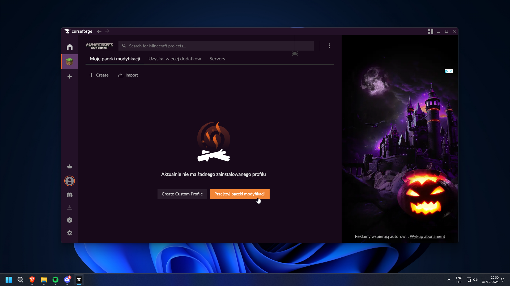
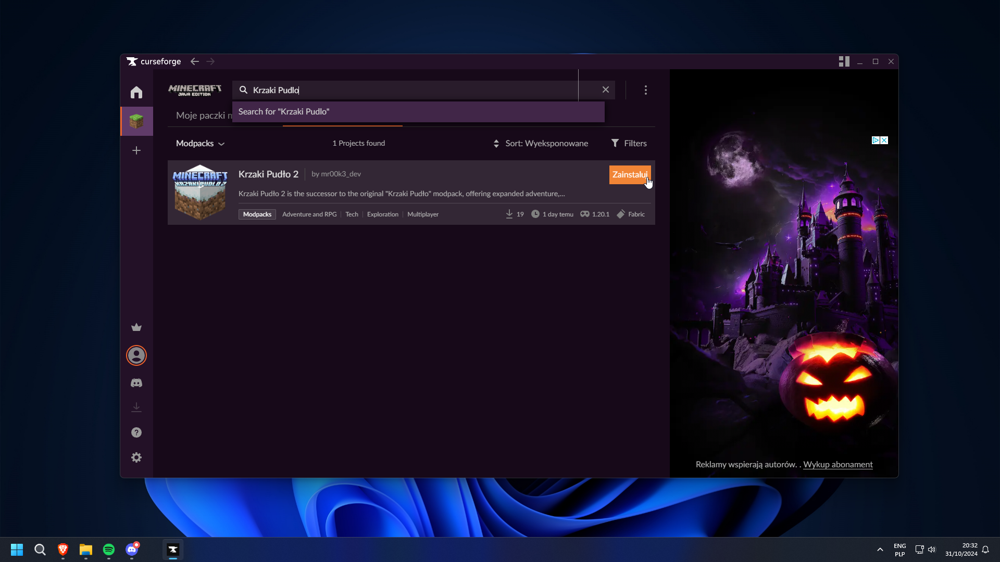
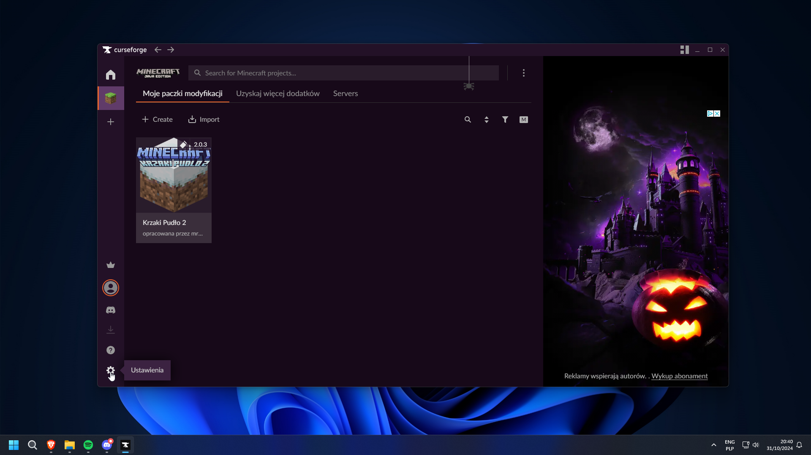
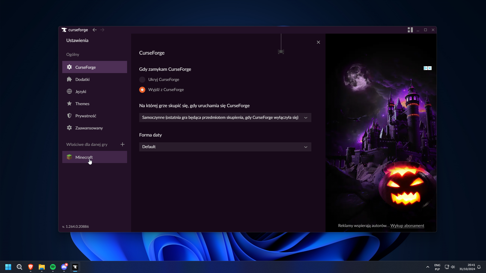
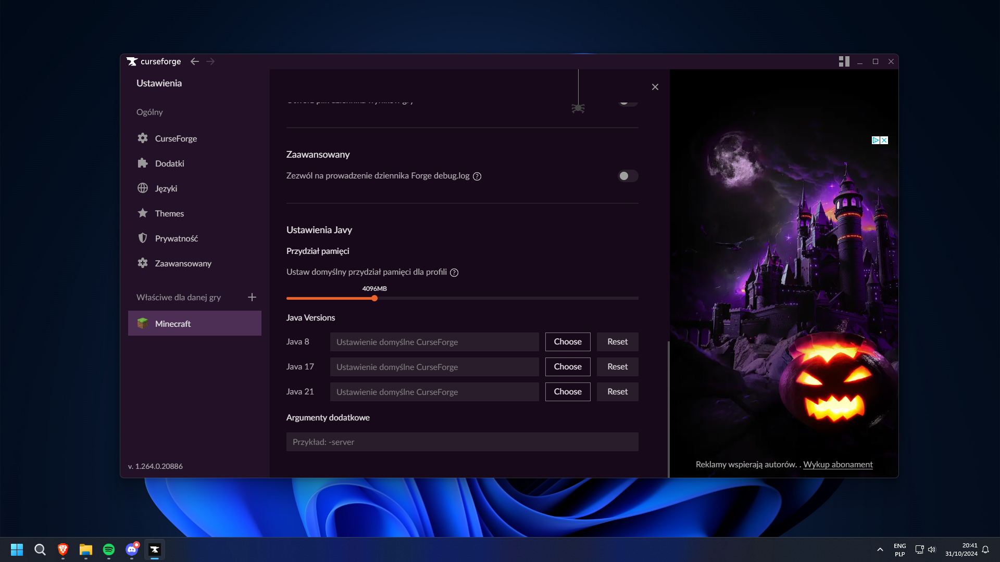

## Pobieranie
Pobierz [CurseForge](https://www.curseforge.com/download/app) i zainstaluj

## Instalacja Paczki

W CurseForge kliknij "Przejrzyj paczki modyfikacji" ⬇️

Wyszukaj "Krzaki Pudło 2" i kliknij "Zainstaluj". Teraz poczekaj na pobranie ⬇️

Po zainstalowaniu **NIE KLIKAJ GRAJ**  
Kliknij w ikone ustawień w lewym dolnym rogu

W ustawieniach kliknij "Minecraft" na pasku boczym

Zjedz na sam dół tych ustawień do sekcji "Ustawienia Javy"

Ustaw suwak na `8196MB` jesli masz **16GB RAM'u** a jesli masz **8GB RAM'u** ustaw na `6144MB`

